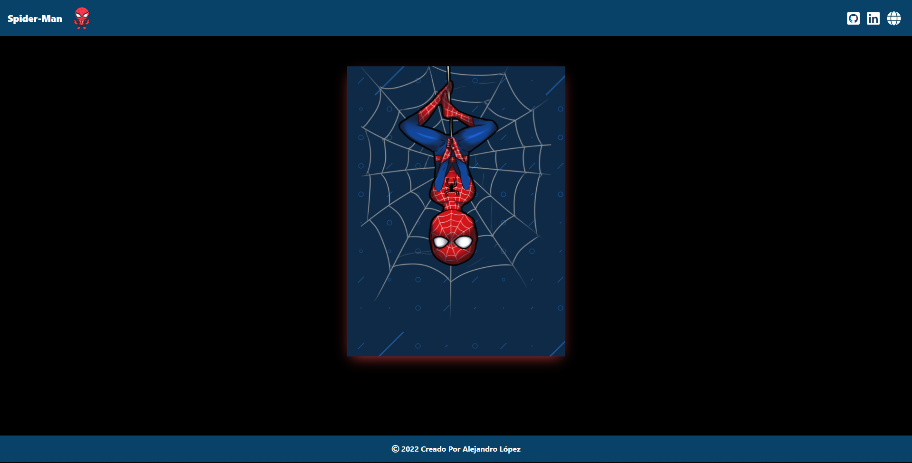

# <h1 align="center" style="color: #80cbc4;"> Animation CSS "Spider-Man" 🕸️ </h1> 
  

## 
 Requirements 

- [HTML5](https://developer.mozilla.org/es/docs/Web/HTML) 
- [CSS3](https://developer.mozilla.org/es/docs/Web/CSS)
- [Bootstrap](https://mdbootstrap.com/)

  

## 
 Screenshot Project 💻 

🔶 [Project Website](https://alejandro-190107.github.io/Spider-Man/)

